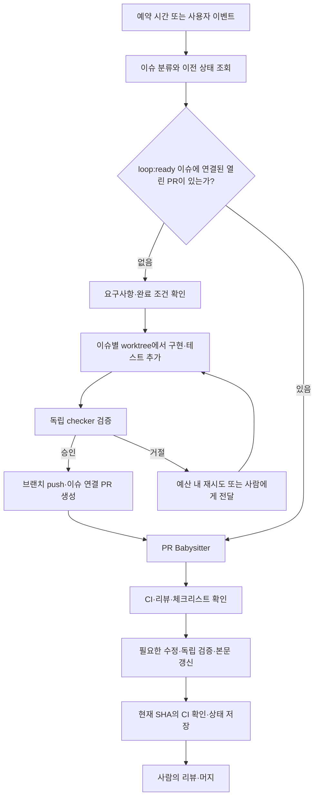

# 이슈 기반 개발 실험

저장소: https://github.com/charmeee/loop-test2  
로컬: `/Users/jeonminji/company/loop-engineer-test2`

작은 Node.js 견적 계산기와 개발할 이슈를 준비한 저장소입니다. 초기 PR은 만들지 않습니다. Loop Engineering 설치·AI runner·예약 실행은 사용자가 아래 안내를 따라 직접 연결합니다. 현재 CI는 애플리케이션 테스트만 실행합니다.

## 준비된 프로젝트

```sh
# 프로젝트 폴더로 이동합니다.
cd /Users/jeonminji/company/loop-engineer-test2
# lockfile 기준으로 의존성을 설치합니다.
npm ci
# 기본 견적 계산기 테스트를 실행합니다.
npm test
# JavaScript 문법을 검사합니다.
npm run lint
# 합계 42.5인 계산 예제를 실행합니다.
npm run demo
```

main은 기본 테스트 4개가 통과합니다. 할인과 통계 기능은 아직 없습니다. 반올림 구현에는 소수 경계값 문제가 있어 이슈로 개선합니다. 기본 테스트 성공만으로 이슈 완료를 판단하지 않습니다.

## 처리할 이슈

| 작업 | 구현 대상 | 주요 완료 조건 |
|---|---|---|
| 할인 계산 기능 | `src/discount.mjs` | 할인율 범위·금액 검증, 0/100% 처리 |
| 금액 목록 통계 | `src/statistics.mjs` | count/total/average, 빈 목록, 입력 검증 |
| 소수 경계값 반올림 수정 | `src/money.mjs` | 양수·음수 half-away-from-zero, 과학적 표기 |

GitHub 이슈 본문에 API·예제·완료 조건을 명시했습니다. `loop:ready` 라벨을 자동 구현 대상 지정에 사용합니다. 이 라벨은 이 저장소의 운영 규칙이며 공식 필수 라벨은 아닙니다.

## 목표 워크플로우



이슈 하나당 연결된 열린 PR은 하나만 만듭니다. 기존 PR이 있으면 새 PR을 만들지 않고 그 PR을 관리합니다. 처리 중에는 `loop:in-progress`, 사람의 결정이 필요하면 `loop:needs-human` 상태를 사용하세요. 초기에는 이슈 1개씩 순차 처리하고, 다른 이슈의 변경을 한 PR에 섞지 않습니다.

**Issue Triage는 분류 담당이고 구현기가 아닙니다.** 구현 작업을 별도 agent에 전달한 뒤 PR Babysitter에 넘기는 coordinator를 연결해야 합니다. `init`만으로 이 전체 흐름이 자동 동작하지 않습니다.

## 사용자가 직접 설정할 Loop Engineering

공식 자료: [저장소](https://github.com/cobusgreyling/loop-engineering), [Issue Triage](https://github.com/cobusgreyling/loop-engineering/blob/main/patterns/issue-triage.md), [작은 작업→PR 가이드](https://github.com/cobusgreyling/loop-engineering/blob/main/docs/refactor.md), [PR Babysitter](https://github.com/cobusgreyling/loop-engineering/blob/main/patterns/pr-babysitter.md).

### 1. 설정 초안 생성

```sh
# 프로젝트 폴더로 이동합니다.
cd /Users/jeonminji/company/loop-engineer-test2
# 이슈 분류 설정의 생성 계획만 확인합니다. 파일은 변경하지 않습니다.
npx --yes @cobusgreyling/loop@0.2.0 init . --pattern issue-triage --tool codex --dry-run
# 확인한 이슈 분류 설정 초안을 실제 생성합니다.
npx --yes @cobusgreyling/loop@0.2.0 init . --pattern issue-triage --tool codex
# 생성된 설정의 준비 상태를 진단합니다.
npx --yes @cobusgreyling/loop@0.2.0 doctor .
# PR 관리 설정은 먼저 미리 보고 기존 설정과 합치는 방식을 결정합니다.
npx --yes @cobusgreyling/loop@0.2.0 init . --pattern pr-babysitter --tool codex --dry-run
# 생성된 skill·상태 파일의 위치를 확인합니다.
rg --files --hidden -g '!.git/**' -g '!node_modules/**' -g 'SKILL.md' -g '*state*.md' -g 'LOOP.md'
```

두 패턴의 init을 무작정 같은 경로에 연속 적용하지 마세요. 생성 계획을 보고 패턴별 state를 분리하고 공통 constraints·budget·coordinator를 구성하세요. 도구 전용 starter가 없으면 공통 starter로 대체될 수 있으므로 실제 출력과 에이전트가 읽는 경로를 확인합니다. 위 npx 명령은 이 저장소 구성 과정에서 실행하지 않았습니다.

### 2. coordinator의 실행 계약

아래 지시를 실제 AI runner에 연결합니다. 첫 실행은 report 모드로 이슈 해석과 변경 계획만 확인하고, 검토 후 repair 모드로 구현을 허용하세요.

```text
대상 저장소는 charmeee/loop-test2다.
constraints, pause, budget, 이전 state와 이슈별 ledger를 먼저 읽는다.
loop:ready 라벨의 열린 이슈와 연결된 PR을 조회한다.
report 모드에서는 계획·판정·상태만 기록하며 코드를 변경하지 않는다.
repair 모드에서 요구사항이 명확하고 연결된 열린 PR이 없는 이슈를 하나 선택한다.
작업 소유권을 확보하고 원격 상태를 다시 확인해 중복 실행을 막는다.
최신 main에서 issue/<번호>-<주제> 브랜치와 격리 worktree를 만든다.
maker는 해당 이슈의 src 구현과 tests 회귀 테스트만 변경한다.
기존 테스트를 삭제·약화하지 않는다. CI, package, 정책 변경은 허용하지 않는다.
독립 checker는 이슈 완료 조건, 허용 diff, 기존 테스트, 새 테스트, 추가 경계값을 검증한다.
maker는 자신의 작업을 완료 판정하지 않는다. 최대 3회 수정 시도 후 중지한다.
승인된 후보를 commit·push하고 이슈를 Closes #번호로 연결한 PR을 하나 만든다.
PR은 개요·변경 사항·검증 결과·요구사항별 체크리스트를 포함한다.
PR Babysitter는 정확한 head SHA의 CI와 리뷰를 조회한다.
검증 실패·실행 가능한 리뷰 의견은 최소 수정 후 별도 checker로 재검증한다.
체크된 항목도 현재 SHA에서 확인하고 증거가 있는 항목만 본문에 반영한다.
사람의 리뷰 완료는 대신 체크하지 않는다. CI 없음은 unknown, pending은 대기다.
본문 갱신 직전 본문과 SHA를 다시 읽고 사람의 편집을 보존한다.
자동 머지는 기본 비활성화다. 실제 머지 전까지 이슈를 자동으로 닫지 않는다.
PR 번호, SHA, 검증 증거, 재시도 횟수와 실제 측정 비용을 지속 저장한다.
```

현재는 원래 후보 PR의 테스트를 보존하는 실험이 아니라 **새 기능의 테스트를 작성하는 실험**입니다. 따라서 `tests/**` 전체를 denylist로 두면 안 됩니다. 이슈에 맞는 새 테스트·보강은 허용하고 기존 검증 약화 여부를 checker가 diff로 검토해야 합니다.

### 3. 예약·사용자 이벤트 연결

사용자가 만들 `.github/workflows/issue-loop.yml`의 연결 예시입니다. **아래 workflow와 `scripts/run-issue-loop.mjs`는 현재 존재하지 않습니다.** 실제 AI 호출, 인증, maker/checker, 상태 저장을 구현한 runner가 필요합니다. YAML만 복사하면 없는 runner 때문에 실패합니다.

```yaml
name: Issue Development Loop
on:
  schedule:
    # UTC 00:00 = 한국 시간 매일 09:00. 예약 실행은 지연될 수 있습니다.
    - cron: '0 0 * * *'
  # GitHub 화면이나 CLI에서 직접 이벤트를 보냅니다.
  workflow_dispatch:
    inputs:
      mode:
        description: '보고 또는 구현·수정'
        type: choice
        options: [report, repair]
        default: report
  # 외부 시스템이 issue-loop 이벤트를 보냅니다.
  repository_dispatch:
    types: [issue-loop]
# 이슈 구현과 PR 수정을 한 번에 하나씩 실행합니다.
concurrency:
  group: issue-loop-loop-test2
  cancel-in-progress: false
permissions:
  contents: write
  issues: write
  pull-requests: write
  checks: read
jobs:
  process:
    runs-on: ubuntu-latest
    timeout-minutes: 30
    steps:
      - uses: actions/checkout@v4
        with:
          fetch-depth: 0
      - uses: actions/setup-node@v4
        with:
          node-version: 22
          cache: npm
      - run: npm ci
      - name: Run coordinator
        env:
          GH_TOKEN: ${{ github.token }}
          # 최초에는 예약 실행도 report로 확인합니다.
          LOOP_MODE: ${{ inputs.mode || github.event.client_payload.mode || 'report' }}
        # 사용자가 구현한 실제 에이전트 runner를 호출합니다.
        run: node scripts/run-issue-loop.mjs --repo charmeee/loop-test2 --mode "$LOOP_MODE"
```

예약 실행까지 구현을 자동화하려면 수동 repair 검증 후 예약의 기본 모드를 repair로 변경하세요. workflow는 default branch에 등록합니다. 인증은 선택한 AI와 GitHub 작업 권한에 맞춰 별도로 연결합니다. `GITHUB_TOKEN`으로 만든 push/PR 이벤트는 일반적으로 다른 workflow를 자동 실행하지 않으므로 적절한 GitHub App/PAT를 쓰거나 후보 브랜치 CI를 명시적으로 dispatch하고 정확한 SHA의 결과를 확인해야 합니다.

Actions 실행 간에는 로컬 state가 남지 않습니다. 별도 상태 브랜치나 외부 저장소로 이슈별 ledger·연결된 PR·검증 SHA를 저장하고 다음 실행에서 복원하세요. pause와 시도 초과도 유지해야 합니다. 스케줄 직렬화만으로 외부 실행까지 잠기지는 않으므로 coordinator에도 이슈별 소유권·중복 PR 검사를 넣으세요.

```sh
# 실제 workflow와 runner를 main에 연결한 뒤 보고 모드로 실행합니다.
gh workflow run issue-loop.yml --repo charmeee/loop-test2 --ref main -f mode=report
# 구현과 PR 관리를 허용하는 수동 실행을 요청합니다.
gh workflow run issue-loop.yml --repo charmeee/loop-test2 --ref main -f mode=repair
# 외부 이벤트로 구현 모드 실행을 요청합니다.
gh api --method POST repos/charmeee/loop-test2/dispatches --input - <<'JSON'
{"event_type":"issue-loop","client_payload":{"mode":"repair"}}
JSON
# 해당 자동화 workflow의 실행 결과를 확인합니다.
gh run list --repo charmeee/loop-test2 --workflow issue-loop.yml --limit 10
# 필요하면 생성된 후보 브랜치의 애플리케이션 CI를 명시적으로 실행합니다.
gh workflow run test.yml --repo charmeee/loop-test2 --ref <후보-브랜치>
```

[GitHub 이벤트·스케줄 조건](https://docs.github.com/en/actions/reference/workflows-and-actions/events-that-trigger-workflows), [토큰에 따른 이벤트 실행 조건](https://docs.github.com/en/actions/how-tos/write-workflows/choose-when-workflows-run/trigger-a-workflow).

## 진행 상태 직접 확인

```sh
# 로그인 상태를 확인합니다.
gh auth status
# 구현 대기 중인 이슈와 요구사항을 조회합니다.
gh issue list --repo charmeee/loop-test2 --state open --label loop:ready --json number,title,body,labels,url
# 이슈에 연결된 PR과 진행 댓글을 확인합니다.
gh issue view <이슈-번호> --repo charmeee/loop-test2 --comments
# 만들어진 PR의 본문 체크리스트와 후보 SHA를 조회합니다.
gh pr list --repo charmeee/loop-test2 --state open --json number,title,body,headRefOid,statusCheckRollup,url
# 정확한 PR의 CI·본문·리뷰를 함께 확인합니다.
gh pr view <PR-번호> --repo charmeee/loop-test2 --json body,headRefOid,statusCheckRollup,reviews
```

성공 기준은 이슈 완료 조건을 충족한 작은 PR 생성, 독립 검증, 현재 SHA의 CI 성공, 근거 있는 체크리스트입니다. 공식 L3는 무인 실행 수준을 뜻하며 자동 머지 자체와 동일하지 않습니다. 자동 머지를 나중에 추가할 때에는 별도 allowlist와 승인 정책을 정하세요.
