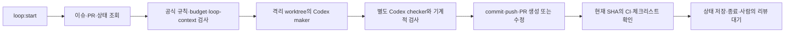

# 이슈 기반 Loop Engineering 실험

저장소: https://github.com/charmeee/loop-test2

Node.js 견적 계산기에 등록된 이슈를 실제 AI가 구현하고, 독립 검증 후 PR로 제출하는 로컬 실험입니다. PR 머지와 이슈 종료는 하지 않습니다.

## 실행

```sh
# 프로젝트 폴더로 이동합니다.
cd /Users/jeonminji/company/loop-engineer-test2
# lockfile 기준으로 의존성을 설치합니다.
npm ci
# 공식 Loop Engineering 설정을 생성합니다. 현재 프로젝트에는 생성 완료했습니다.
npm run loop:setup
# 먼저 이슈·PR 목록을 확인하고 상태만 기록합니다.
npm run loop:report
# 이슈 하나를 구현·독립 검증하고 PR을 생성하거나 기존 PR을 관리합니다.
npm run loop:start
# 특정 이슈를 지정하려면 번호를 전달합니다.
npm run loop:start -- --issue 1
```

setup은 재실행해도 기존 설정을 유지합니다. start는 기본 repair 모드이며 한 사이클에 최대 이슈 하나를 처리합니다. 다시 실행하면 기존 PR·상태를 확인하고 다음 작업을 처리합니다. 예약은 등록하지 않았습니다. 로그인된 Codex·gh CLI, GitHub SSH 인증, Node.js 22 이상이 필요합니다.

## 작업 입력

| 이슈 | 내용 |
|---|---|
| [#1](https://github.com/charmeee/loop-test2/issues/1) | 할인 계산 API와 입력 검증 |
| [#2](https://github.com/charmeee/loop-test2/issues/2) | 금액 목록 통계·빈 목록·입력 검증 |
| [#3](https://github.com/charmeee/loop-test2/issues/3) | 소수 경계값·음수 반올림 수정 |

ready/in-progress 이슈를 조회하며, 연결된 PR이 있으면 그 PR을 관리합니다. 기존 테스트를 보존하고 이슈별 테스트를 새로 추가합니다.



## 상세 문서

- [실제 명령·생성 구성·사용법](docs/loop-commands.md)
- [runner 구현 구조와 현재 범위](docs/runner-implementation.md)
- [공식 Loop Engineering](https://github.com/cobusgreyling/loop-engineering)

## 프로젝트 검증

```sh
# 전체 테스트를 실행합니다.
npm test
# 하위 폴더를 포함한 JavaScript 문법을 검사합니다.
npm run lint
# 기본 견적 합계 42.5를 출력합니다.
npm run demo
```

상태와 AI 로그는 로컬 `.loop-runtime/`에 저장하고 Git에서 제외합니다. 다른 컴퓨터나 GitHub Actions에서 같은 작업을 이어가려면 상태 저장과 분산 잠금을 별도로 연결해야 합니다.
