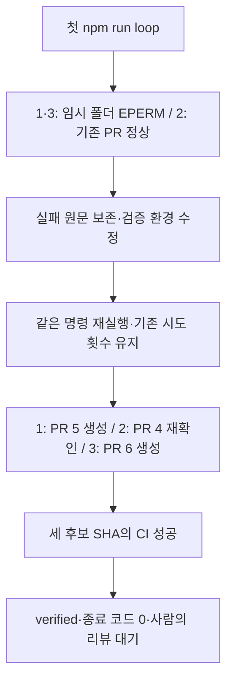

# npm run loop 실제 실행 결과

2026-10-06에 `/Users/jeonminji/company/loop-engineer-test2`에서 `npm run loop`를 실행하고 로그를 수집했습니다. 테스트 실행 환경 문제를 수정한 뒤 같은 명령으로 재실행했고, **최종 종료 코드 0·이슈 3개 모두 verified**를 확인했습니다. PR과 이슈는 머지·종료하지 않았습니다.

## 최종 결과

| 이슈 | 연결 PR | 프로그램 판정 | 해당 후보의 로컬 테스트 수 | 후보 SHA의 CI | PR 상태 |
|---|---|---|---:|---|---|
| #1 | [PR #5](https://github.com/charmeee/loop-test2/pull/5) | verified | 16 | 성공 | OPEN |
| #2 | [PR #4](https://github.com/charmeee/loop-test2/pull/4) | verified | 17 | 성공 | OPEN |
| #3 | [PR #6](https://github.com/charmeee/loop-test2/pull/6) | verified | 17 | 성공 | OPEN |

#1·#3은 이번에 새로 구현·검증해 PR을 만들었습니다. #2는 기존 PR #4의 SHA·피드백·CI를 재확인했으며 AI 구현을 중복 실행하지 않았습니다. 테스트 수는 각 독립 PR 후보의 값으로, 세 PR을 머지한 통합 테스트 수가 아닙니다. 사람의 코드 리뷰 체크박스는 모두 미체크입니다.

## 첫 실행에서 발견·수정한 문제

첫 배치는 #1·#3의 기능 검증은 통과했지만 읽기 전용 checker에서 자동화 테스트가 임시 폴더를 만들지 못해 EPERM을 냈습니다. 따라서 프로그램이 두 작업을 보류했고 종료 코드 1을 반환했습니다. #2는 정상 재확인됐습니다.

checker를 workspace-write sandbox의 검증 전용 세션으로 보정했습니다. 테스트의 임시 파일 쓰기만을 위한 변경이며, 후보 코드 변경 금지 지시와 검증 전후 snapshot 비교를 유지했습니다. 테스트 삭제·skip, 토큰 cap 복원, 시도 제한 증가, sandbox 해제는 하지 않았습니다. 누적 시도는 #1이 3회, #3이 2회이며 과거 실패 기록도 남아 있습니다.

또한 batch-summary의 startedAt이 종료 시각으로 기록되던 부분을 고쳐 후속 실행에는 시작·종료 시각을 각각 저장했습니다. 첫 실행의 실제 시간은 metadata.json에 있습니다.

## 실행별 원문과 시간

- [최초 실행 — 환경 제한으로 일부 보류](runs/2026-10-06T03-32-23Z/README.md): 12:32:23–12:35:17 KST, 173.7초, 종료 코드 1.
- [수정 후 실행 — 전체 검증 성공](runs/2026-10-06T03-37-27Z/README.md): 12:37:27–12:41:10 KST, 223.6초, 종료 코드 0.

각 실행 폴더에는 콘솔 원문, before/after 상태·ledger, maker/checker의 구조화된 판정과 도구 명령·출력, 토큰 사용량, GitHub PR·CI 스냅샷이 있습니다. 최종 폴더에는 정확한 SHA의 CI 원문 6개도 수집했습니다. #2의 CI 원문은 기존 실행 결과의 재확인 자료입니다. AI reasoning 서술은 공개 로그에서 제외했고, 원본 로컬 로그는 `.loop-runtime`에 유지했습니다.

## 이 실행에서 사용한 구성

- `npm run loop`: 시작 시 열린 loop:ready 이슈 3개 전체 조회, 번호순 처리.
- 공식 Loop Engineering: 생성된 skills·constraints·state 사용, loop-context 1.5.0으로 이슈별 3회·반복 실패 검사.
- Codex CLI: 구현과 독립 검증을 별도 세션으로 수행, 에이전트별 도구 작업 20회·10분 제한.
- git / gh CLI: 격리 worktree, commit·SSH push, PR 생성·본문 갱신, 현재 SHA의 CI 확인.
- GitHub Actions: npm ci·npm test·npm run lint. 머지 자동화 없음.

설정·명령 설명은 [loop-commands.md](loop-commands.md), 구현 구조는 [runner-implementation.md](runner-implementation.md)를 참고하세요.
