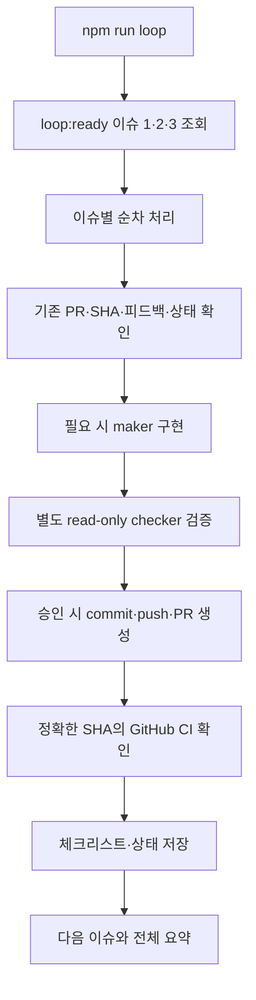

# npm run loop 실행 결과

- 실행 폴더: `/Users/jeonminji/company/loop-engineer-test2`
- 명령: `npm run loop`
- 시작: 2026-10-06T03:32:23.657728+00:00 (UTC)
- 종료: 2026-10-06T03:35:17.353760+00:00 (UTC)
- 경과: 173.7초
- 프로그램 종료 코드: **1**
- 실행 코드 커밋: `97741931cb80e721201e2799dec23e81a650dbd7`

## 이슈별 결과

| 이슈 | 이번 배치 결과 | 이번 새 구현·검증 시도 | 연결 PR | 정확한 SHA의 CI |
|---|---|---:|---|---|
| #1 | failed | 1 | 없음 | 없음/대기 |
| #2 | verified | 0 | [#4](https://github.com/charmeee/loop-test2/pull/4) | success |
| #3 | failed | 1 | 없음 | 없음/대기 |

이번 실행은 시작 시 loop:ready 이슈 3개를 조회해 번호순으로 처리했습니다. 이전 시도는 before에, 실행 후 누적 상태는 after에 분리했습니다. 기존 검증 결과를 재사용한 작업과 새 AI 실행을 구분합니다. CI 결과는 수집 시점의 스냅샷입니다.

## 실제 사용한 도구

- gh CLI: 이슈·PR·리뷰 조회, PR 생성·본문 갱신, CI 상태·원문 로그 수집.
- git: origin fetch, 이슈별 detached worktree, commit, SSH push. force push 없음.
- Codex exec: maker(workspace-write)와 별도 checker(read-only), 구조화된 JSON 판정.
- 공식 loop-context 1.5.0: 이슈별 ledger로 최대 3회·반복 실패 확인. 토큰 cap 없음.
- npm test / npm run lint: 로컬 검증 및 GitHub Actions의 앱 검증.

이슈별로 이번에 실제 실행된 명령과 출력은 agents/*/*-events.jsonl에 있습니다. toolActions는 started/completed를 같은 작업 ID로 합쳐 계산했습니다. 토큰 수는 과금액이 아니며 캐시 입력은 전체 입력의 부분집합입니다.

## AI 세션 사용량

| 이슈 실행 | 역할 | 도구 작업 | 입력 | 그중 캐시 | 출력 |
|---|---|---:|---:|---:|---:|
| run-1791257547423-issue-1 | checker | 5 | 141410 | 114816 | 1285 |
| run-1791257547423-issue-1 | maker | 6 | 151168 | 136448 | 1151 |
| run-1791257635167-issue-3 | checker | 7 | 145799 | 118144 | 1386 |
| run-1791257635167-issue-3 | maker | 6 | 121527 | 94976 | 1433 |

## 수집 파일

- [console.log](console.log): 이번 npm 명령의 실제 콘솔 출력.
- [metadata.json](metadata.json): 명령·실행 시간·코드 SHA·종료 코드.
- [batch-summary.json](batch-summary.json): 이슈별 프로그램 판정.
- [agent-metrics.json](agent-metrics.json): 이번 새 AI 세션의 도구 작업 수와 사용량.
- before/ · after/: 이슈 상태와 누적 ledger. 이전 실패 기록은 보존했습니다.
- agents/: 이번 새 maker/checker의 JSON 판정 및 명령·결과 JSONL. reasoning 서술은 수집 대상에서 제외했습니다.
- github/: 수집 시점의 이슈·PR 본문·SHA·CI 스냅샷.
- [ci-index.json](ci-index.json), ci/: 정확한 후보 SHA의 GitHub Actions 실행과 원문 로그.

## 머지·이슈 종료 확인

- 이슈 상태: #3 OPEN, #2 OPEN, #1 OPEN.
- PR 상태: #4 OPEN.
- 실행 코드에는 PR merge/issue close 호출이 없습니다. 사람의 코드 리뷰 항목은 자동 완료 처리하지 않습니다.

## 첫 배치의 보류 원인과 후속 조치

#1·#3은 기능 자체의 검증은 통과했지만, read-only checker의 전체 테스트 중 `tests/loop-agent-process.test.mjs`가 임시 디렉터리를 만들지 못해 EPERM을 냈습니다. 이 테스트는 자동화 runner의 프로세스 제한을 검증하는 테스트입니다. assertion을 삭제하거나 테스트를 skip하지 않았습니다.

테스트용 쓰기가 가능한 workspace-write로 checker 환경을 보정했고, 후보 코드 수정 금지 지시와 검증 전후 snapshot 검사는 유지했습니다. 기존 실패 횟수는 그대로이며, #1은 누적 3회 제한 안의 마지막 시도, #3은 두 번째 시도로 재실행합니다. 첫 실행 결과는 위 원문과 before/after에 보존했습니다.

이 실행의 batch-summary.json.startedAt은 당시 코드에서 종료 시각으로 저장되던 필드입니다. 실제 시작·종료 시각은 metadata.json을 사용합니다. 후속 실행 코드에서 이를 수정했습니다.
